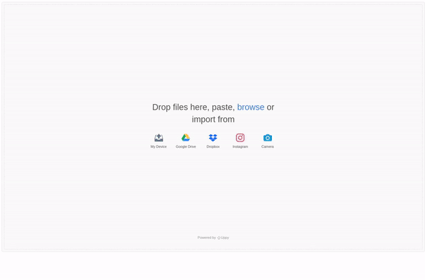
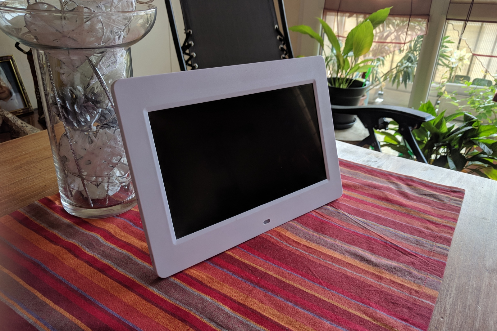

# ZeroFrame

A web based application to upload files to your Raspberry Pi Zero used as an USB mass storage.

Checkout my [blog post](https://blog.victormeunier.com/zero_frame.html) for more information!

    

Web interface using [Uppy](https://uppy.io/)

    

My digital frame

## Getting Started

For detailed instructions, head to my [blog post](https://blog.victormeunier.com/zero_frame.html).

## Authors

* **Victor MEUNIER** - *ZeroFrame* - [MrEliptik](https://github.com/MrEliptik) - [victormeunier.dev@gmail.com](mailto:victormeunier.dev@gmail.com)

Want to support me? Buy me a coffee!

## License

This project is licensed under the MIT License - see the [LICENSE.md](LICENSE.md) file for details

